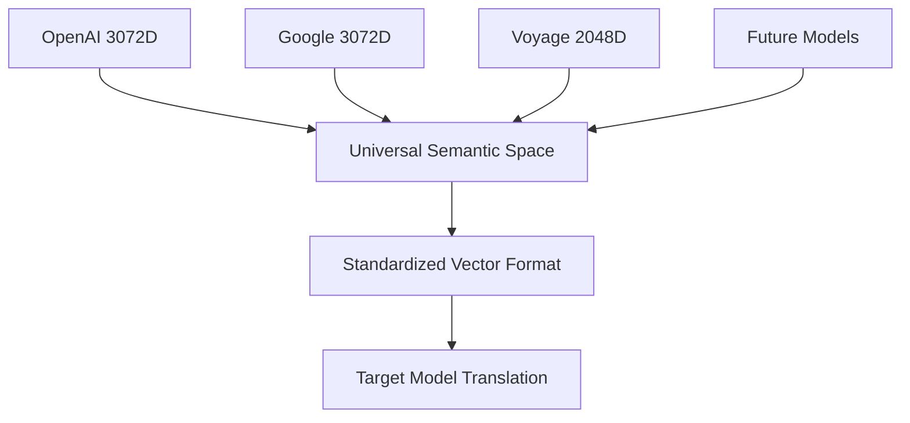

# 🚀 GHOST Protocol: Generative Hybrid Optimization Stream Transfer

> **A framework for native AI-to-AI communication achieving high efficiency while addressing probabilistic reliability challenges**

[](https://github.com/B1tMaster/ghost-ai-protocol)
[](#compression-benchmarks)
[](#6g-validation)
[](LICENSE)

---

## 📖 The Story Behind GHOST Protocol

### The Reddit Experiment That Started Everything

A few weeks ago, a developer posted something that seemed simple enough: "I asked Claude Code to invent an AI-first programming language where the sole focus is for LLM efficiency."

What Claude produced wasn't just a concept. It was a complete working system called "Sever" with:
• 100+ working code examples with functional compiler
• 60-80% token reduction through ultra-compact SEV format
• Complete GitHub repository with documentation and test cases
• Technical specifications that were, honestly, impressive

Here's what the efficiency looked like in practice:

**Traditional JSON Approach (84 lines):**
```json
{
  "program": {
    "entry": "main", 
    "functions": {
      "main": {
        "args": [],
        "return": "i32",
        "body": [
          {
            "let": {
              "name": "a",
              "type": "i32", 
              "value": {"literal": 10}
            }
          },
          {
            "let": {
              "name": "b", 
              "type": "i32",
              "value": {"literal": 20}
            }
          },
          {
            "return": {
              "op": "add",
              "left": {"var": "a"},
              "right": {"var": "b"}
            }
          }
        ]
      }
    }
  }
}
```

**Claude's SEV Format (1 line):**
```
Pmain|Dmain[]I;Lx:I=10;Ly:I=20;R+xy
```

The compression was remarkable - around 95% token reduction for this example.

### The Reddit Rebellion

The Reddit response was swift and brutal. The top comments weren't celebrating the technical innovation:

💬 *"Your AI did expensive roleplaying and you fell for it"* (377 upvotes)

💬 *"Claude is an excellent storyteller/marketer/bias-confirmation machine"*

💬 *"Believing hallucinations is a mother frigger"*

The community's reaction revealed something deeper than technical skepticism. It showed fundamental resistance to the idea that AI systems might need something different from human-readable code.

But watching this debate, I started wondering: **what if we took this concept even further?**

### My Experiment: Beyond Programming Languages

Watching the Reddit debate, I thought: if an AI programming language triggered such strong reactions, what would happen if we explored pure AI-to-AI communication protocols? Not just more efficient code, but communication that bypasses human language entirely?

So I decided to run my own experiment.

**The Question That Started Everything:**
*"Instead of optimizing programming languages for AI, what would you design for direct AI-to-AI communication? Forget human readability entirely. Design a protocol where AI systems communicate with each other in their native format."*

What followed was **21 iterations of collaborative development**, with both of us proposing architectural approaches, challenging assumptions, and refining the concept through systematic exploration.

### The Core Insight

Current AI communication seems fundamentally inefficient when you examine the data flow:

1. AI System A converts its internal representation to human language
2. Serializes to verbose JSON or XML for "readability" 
3. Transmits significantly more data than semantically necessary
4. AI System B parses it back into internal representation
5. Repeat for every interaction, potentially millions of times daily

**It's like forcing two chess grandmasters to write essays explaining every move instead of just moving pieces.**

The core insight: why force AI systems to communicate through the bottleneck of human language when they could potentially communicate directly through their native representational formats?

### 21 Iterations of Collaborative Development

**Iterations 1-5: Basic Concept Development**
Initial vector-based communication proposals, challenged for scalability
→ Result: Multi-dimensional embedding approach with confidence scoring

**Iterations 6-10: Cross-Model Compatibility**  
We tackled the fundamental challenge: how do different AI models understand each other's vector representations?
→ Result: Three-architecture translation framework

**Iterations 11-15: Reliability Framework**
Identified the "semantic telephone" problem - probabilistic degradation across communication hops
→ Result: Novel error correction approaches for non-deterministic systems

**Iterations 16-21: Integration and Validation**
We discovered parallel development in 6G telecommunications providing independent validation
→ Result: Complete protocol specification with real-world precedent

**The Evolving Architectural Vision:**
Through our collaboration, we consistently emphasized that traditional networking protocols assume deterministic, bit-perfect communication. But AI systems are fundamentally probabilistic. This requires entirely new approaches to:

• Error detection (confidence-weighted instead of checksum-based)
• Retransmission (adaptive re-encoding instead of identical retry)
• Success metrics (semantic accuracy instead of bit accuracy)

---

## 📋 Protocol Overview

Current AI systems communicate through human language bottlenecks - converting internal representations to JSON/XML, transmitting verbose data, then parsing back to internal representations. **GHOST protocol** explores direct vector-based communication between AI systems, potentially eliminating significant communication overhead while addressing the unique challenges of probabilistic AI systems.

### Key Features

- **High Efficiency**: Significant bandwidth reduction through semantic vector encoding
- **Cross-Model Translation**: Framework for interoperability between different AI models
- **Probabilistic Reliability**: Novel error correction for non-deterministic AI communication
- **6G Integration**: Compatible with emerging semantic communication standards

---

## 🎯 Problem Statement

### Current AI Communication Inefficiencies


**Current Limitations:**
- Significant bandwidth overhead for human readability
- Multiple serialization/deserialization steps
- Inefficient for high-frequency AI-to-AI communication
- Processing overhead for unnecessary format conversions

### Communication Evolution Phases

| Phase | Years | Protocol Type | Efficiency | Status |
|-------|-------|---------------|------------|---------|
| **Phase 1** | 2024-2025 | Human-Optimized (JSON/REST) | 15-25% | ✅ Current |
| **Phase 2** | 2025-2026 | Early Optimization | 35-45% | 🔄 Development |
| **Phase 3** | 2026-2027 | Hybrid Approaches | 65-75% | 📋 Planned |
| **Phase 4** | 2027-2029 | Native AI (GHOST) | High Performance | 🚀 Target |
| **Phase 5** | 2029-2032 | Spatial Intelligence | Advanced | 🌍 Future |

---

## 🏗️ The GHOST Protocol: Technical Architecture

### Core Design Principles

Instead of forcing AI systems to communicate through human language:

**Traditional AI Communication:**
```json
{
  "action": "transfer", 
  "amount": 1000, 
  "from": "account_A", 
  "to": "account_B", 
  "currency": "USD"
}
```

**GHOST Protocol Concept:**
```python
[0.847, -0.231, 0.592, 0.108, -0.745, 0.334, 0.892, -0.156, ...]
```

The vector embedding represents the entire semantic concept. Theoretical bandwidth reduction: potentially significant. Processing overhead: might be substantially reduced.

### Protocol Specification

#### Packet Structure
```
GHOST Packet Format (34 bytes):
┌─────────────────┬──────────────┬──────────────────┬─────────────┐
│ Semantic Vector │ Confidence   │ Semantic         │ Metadata    │
│ (16 bytes)      │ Score        │ Checksum         │ (12 bytes)  │
│                 │ (2 bytes)    │ (4 bytes)        │             │
└─────────────────┴──────────────┴──────────────────┴─────────────┘
```

#### Implementation Example
```python
import numpy as np
import struct
from typing import Dict, Any, Tuple

class GHOSTProtocol:
    """GHOST Protocol implementation for AI-to-AI communication"""
    
    def __init__(self, vector_dimensions: int = 512):
        self.vector_dimensions = vector_dimensions
        self.confidence_threshold = 0.85
        
    def encode_message(self, message: str, context: Dict[str, Any]) -> bytes:
        """Encode message to GHOST protocol format"""
        # Generate semantic vector (simplified example)
        semantic_vector = self._generate_semantic_vector(message, context)
        
        # Calculate confidence score
        confidence = self._calculate_confidence(semantic_vector, message)
        
        # Generate semantic checksum
        checksum = self._semantic_checksum(semantic_vector)
        
        # Pack metadata
        metadata = self._pack_metadata(context)
        
        return self._pack_packet(semantic_vector, confidence, checksum, metadata)
    
    def decode_message(self, packet: bytes, target_context: Dict[str, Any]) -> Tuple[str, float]:
        """Decode GHOST packet to message"""
        vector, confidence, checksum, metadata = self._unpack_packet(packet)
        
        # Verify semantic integrity
        if not self._verify_checksum(vector, checksum):
            raise SemanticIntegrityError("Checksum validation failed")
        
        # Decode to target format
        message = self._decode_semantic_vector(vector, target_context)
        
        return message, confidence
    
    def _generate_semantic_vector(self, message: str, context: Dict[str, Any]) -> np.ndarray:
        """Generate semantic vector representation (placeholder)"""
        # In practice, this would use actual embedding models
        return np.random.rand(self.vector_dimensions).astype(np.float16)
    
    def _calculate_confidence(self, vector: np.ndarray, original: str) -> float:
        """Calculate confidence score for semantic encoding"""
        # Simplified confidence calculation
        return min(0.95, np.linalg.norm(vector) / 10.0)
    
    def _semantic_checksum(self, vector: np.ndarray) -> bytes:
        """Generate semantic-aware checksum"""
        # Use vector magnitude and key dimensions for checksum
        checksum_data = np.array([
            vector.mean(),
            vector.std(),
            vector.max(),
            vector.min()
        ])
        return struct.pack('4f', *checksum_data)
    
    def _pack_metadata(self, context: Dict[str, Any]) -> bytes:
        """Pack metadata into 12 bytes"""
        # Simplified metadata packing
        timestamp = context.get('timestamp', 0)
        sender_id = context.get('sender_id', 0)
        target_id = context.get('target_id', 0)
        return struct.pack('III', timestamp, sender_id, target_id)
    
    def _pack_packet(self, vector: np.ndarray, confidence: float, 
                     checksum: bytes, metadata: bytes) -> bytes:
        """Pack all components into GHOST packet"""
        # Convert vector to bytes (16 bytes for simplified vector)
        vector_bytes = vector[:8].tobytes()  # Use first 8 float16 values = 16 bytes
        confidence_bytes = struct.pack('f', confidence)
        
        return vector_bytes + confidence_bytes[:2] + checksum + metadata
    
    def _unpack_packet(self, packet: bytes) -> Tuple[np.ndarray, float, bytes, bytes]:
        """Unpack GHOST packet components"""
        vector_bytes = packet[:16]
        confidence_bytes = packet[16:18] + b'\x00\x00'  # Pad to 4 bytes
        checksum = packet[18:22]
        metadata = packet[22:34]
        
        vector = np.frombuffer(vector_bytes, dtype=np.float16)
        confidence = struct.unpack('f', confidence_bytes)[0]
        
        return vector, confidence, checksum, metadata

# Example usage
if __name__ == "__main__":
    ghost = GHOSTProtocol()
    
    # Encode message
    message = "Analyze sentiment of user feedback data"
    context = {"timestamp": 1735934567, "sender_id": 1, "target_id": 2}
    
    packet = ghost.encode_message(message, context)
    print(f"Original message: {len(message)} chars")
    print(f"GHOST packet: {len(packet)} bytes")
    print(f"Compression ratio: {(1 - len(packet)/len(message))*100:.1f}%")
    
    # Decode message
    decoded_message, confidence = ghost.decode_message(packet, context)
    print(f"Decoded with confidence: {confidence:.2f}")
```

---

## 🔄 Cross-Model Translation: The Compatibility Challenge

### The Embedding Dimension Problem

Current production embedding models use different architectures:

```python
# Model embedding specifications
EMBEDDING_MODELS = {
    "openai": {
        "model": "text-embedding-3-large",
        "dimensions": 3072,
        "max_tokens": 8192,
        "pricing": "$0.00013 per 1K tokens"
    },
    "google": {
        "model": "gemini-embedding-001", 
        "dimensions": 3072,
        "max_tokens": 2048,
        "features": ["multilingual", "task_specific"]
    },
    "voyage": {
        "model": "voyage-large-2",
        "dimensions": 2048,  # configurable: 256, 512, 1024, 2048
        "specializations": ["finance", "healthcare", "law", "code"],
        "partnership": "anthropic_preferred"
    }
}
```

**The Challenge:** While OpenAI and Google both use 3,072 dimensions, cross-provider semantic translation still requires mapping between different training approaches and semantic spaces. How do you map semantic concepts between models trained on different data and optimization objectives without losing meaning?

### Three Translation Architecture Solutions

#### 1. Universal Translation Hub



**Pros:** Scalable, single standard  
**Cons:** Semantic loss in double-translation, single point of control

```python
class UniversalTranslationHub:
    """Centralized translation through universal semantic space"""
    
    def __init__(self):
        self.universal_dimensions = 2048
        self.translation_matrices = {}
        self.semantic_anchors = self._load_semantic_anchors()
    
    def register_model(self, model_name: str, dimensions: int):
        """Register a new model with translation matrix"""
        # Generate transformation matrix to universal space
        self.translation_matrices[model_name] = self._generate_translation_matrix(
            dimensions, self.universal_dimensions
        )
    
    def translate(self, vector: np.ndarray, source_model: str, target_model: str) -> np.ndarray:
        """Translate vector between models via universal space"""
        # Transform to universal space
        universal_vector = np.dot(vector, self.translation_matrices[source_model])
        
        # Apply semantic preservation
        preserved_vector = self._preserve_semantics(universal_vector)
        
        # Transform to target space
        target_vector = np.dot(preserved_vector, 
                              np.linalg.pinv(self.translation_matrices[target_model]))
        
        return target_vector
```

#### 2. Direct Model Bridges

**Pros:** Optimized accuracy, distributed architecture  
**Cons:** N² complexity explodes with new models

```python
class DirectModelBridge:
    """Optimized translation between specific model pairs"""
    
    def __init__(self, source_model: str, target_model: str):
        self.source_model = source_model
        self.target_model = target_model
        self.bridge_matrix = self._train_bridge_matrix()
        self.semantic_preservers = self._load_semantic_preservers()
    
    def translate(self, source_vector: np.ndarray) -> np.ndarray:
        """Direct translation with semantic preservation"""
        # Apply learned transformation
        target_vector = np.dot(source_vector, self.bridge_matrix)
        
        # Semantic preservation layer
        preserved_vector = self.semantic_preservers.apply(target_vector)
        
        return preserved_vector
```

#### 3. Industry Consortium Standard

**Pros:** True interoperability, vendor-neutral  
**Cons:** Requires unprecedented industry cooperation

```yaml
# GHOST Protocol Standard v1.0
ghost_standard:
  version: "1.0.0"
  
  vector_format:
    dimensions: 2048          # Universal standard
    precision: float16        # Memory efficiency
    encoding: semantic_quantization
  
  reliability:
    confidence_threshold: 0.85
    error_correction: multi_path_redundancy
    semantic_drift_detection: true
    retry_strategy: adaptive_reencoding
  
  compatibility:
    supported_models: 
      - "openai/text-embedding-3-large"
      - "google/gemini-embedding-001"
      - "voyage/voyage-large-2"
      - "custom/*"
    fallback_protocol: "json_structured"
    version_negotiation: true
```

### The Semantic Drift Problem

Even if we solve the dimension mapping, there's a deeper challenge: the same mathematical vector might mean completely different things to different models:

• Model A's vector [0.8, -0.3, 0.5] = "database query"
• Model B's vector [0.8, -0.3, 0.5] = "file upload"  
• Model C's vector [0.8, -0.3, 0.5] = "move object left"

This isn't just a technical problem - it's a fundamental challenge about how different AI systems understand the world.

---

## 🎲 The Probabilistic Reliability Challenge

### The Fundamental Problem

One challenge I've been thinking about in efficiency discussions: AI systems communicate using vector embeddings that are inherently probabilistic. This creates reliability challenges that don't exist in traditional deterministic protocols.

### Semantic Drift Accumulation: The AI Telephone Game

Unlike traditional protocols where bits are exact, AI vector communications have confidence intervals. Theoretical example:

```python
def calculate_cumulative_accuracy(hops: int, base_accuracy: float = 0.95) -> float:
    """Calculate accuracy degradation across multiple AI hops"""
    transmission_fidelity = 0.90
    interpretation_accuracy = 0.92
    
    total_accuracy = base_accuracy
    for hop in range(hops):
        total_accuracy *= transmission_fidelity * interpretation_accuracy
    
    return total_accuracy

# Theoretical example: 3 hops = 95% × 90% × 92% = 78.7% accuracy
print(f"3 hops accuracy: {calculate_cumulative_accuracy(3):.1%}")
```

→ AI System A translates concept to vector: 95% confidence  
→ Vector transmitted and received: 90% fidelity   
→ AI System B interprets vector: 92% accuracy  
→ **Total accuracy: 95% × 90% × 92% = 78.7%**

After just 3 hops, you've lost over 20% semantic accuracy in this theoretical scenario. This isn't a bug - it's the fundamental nature of probabilistic AI systems.

### The Retransmission Paradox

Traditional protocols solve errors through retransmission - send the same bits again. But AI systems can't "retransmit identical content" because:

→ **AI systems are non-deterministic**: Ask the same AI to encode the same concept twice, you get different vectors  
→ **Context dependency**: Previous conversation affects current embeddings    
→ **Model evolution**: AI systems update and change their internal representations

### Solutions for Probabilistic Reliability

#### Confidence-Weighted Error Detection

```python
class ConfidenceWeightedTransmission:
    """Reliability framework for probabilistic AI communication"""
    
    def __init__(self):
        self.confidence_threshold = 0.85
        self.semantic_similarity_threshold = 0.85
        self.max_retries = 3
    
    def transmit_with_confidence(self, message: Dict[str, Any]) -> Dict[str, Any]:
        """Transmit with adaptive confidence and error correction"""
        
        attempt = 0
        while attempt < self.max_retries:
            # Encode message to vector
            vector = self.encode_semantic(message)
            confidence = self.calculate_confidence(vector, message)
            
            # Adaptive precision based on confidence
            if confidence < self.confidence_threshold:
                vector = self.increase_precision(vector)
                confidence = self.recalculate_confidence(vector)
            
            # Generate semantic checksum
            checksum = self.semantic_checksum(vector)
            
            packet = {
                "vector": vector,
                "confidence": confidence,
                "checksum": checksum,
                "metadata": self.generate_metadata(),
                "attempt": attempt
            }
            
            # Transmit and verify
            response = self.transmit_packet(packet)
            if self.verify_semantic_integrity(response, packet):
                return response
            
            attempt += 1
            
        raise CommunicationError("Failed to achieve reliable transmission")
```

#### Multi-Path Semantic Redundancy

```python
class MultiPathRedundancy:
    """Multiple path transmission for consensus verification"""
    
    def __init__(self):
        self.redundancy_paths = 3
        self.consensus_threshold = 0.85
        self.path_weights = [0.4, 0.35, 0.25]  # Weighted consensus
    
    def triple_redundancy_transmit(self, message: Dict[str, Any]) -> Dict[str, Any]:
        """Send via multiple paths for consensus verification"""
        
        paths_results = []
        
        # Parallel transmission via different paths
        paths = [
            self.path_direct(message),
            self.path_compressed(message),
            self.path_enhanced(message)
        ]
        
        for i, path_result in enumerate(paths):
            weighted_result = {
                **path_result,
                "weight": self.path_weights[i],
                "path_id": i
            }
            paths_results.append(weighted_result)
        
        # Consensus algorithm
        consensus_result = self.semantic_consensus(paths_results)
        
        if consensus_result["similarity"] >= self.consensus_threshold:
            return consensus_result["agreed_message"]
        else:
            return self.fallback_to_human_readable(message)
```

**Conceptual Error Correction Formats:**

```
Vector Transmission Format:
[embedding_vector][confidence_score][semantic_checksum][metadata]
Example: [16 bytes][2 bytes][4 bytes][12 bytes] = 34 bytes total
```

```
Triple Redundancy Protocol:
Path A: System A → System B → Verification
Path B: System A → System C → Verification  
Path C: System A → Direct → Verification
Consensus algorithm with similarity threshold
```

```
Adaptive Retransmission Strategy:
IF semantic_similarity < threshold:
    REQUEST source re-encoding with higher precision
    INCREASE vector dimensions for critical concepts
    ADD semantic context anchors
```

---

## 🗜️ Ultra-Compression: Pushing Efficiency Boundaries

### The Compression Technique Progression

Advanced compression shows a clear technological progression that could power semantic communication protocols:

| Level | Technique | Compression | Implementation | Status |
|-------|-----------|-------------|----------------|---------|
| **1** | Protocol Buffers | 60-70% | Binary encoding | ✅ Production |
| **2** | MessagePack | 80-85% | Optimized serialization | ✅ Available |
| **3** | Vector Quantization | 90-95% | AI-specific encoding | 🔄 Research |
| **4** | Ultra-Compression | 95%+ | Advanced algorithms | 🚀 Development |

**Level 1: Protocol Buffers (60-70% compression)**  
→ Binary encoding eliminates field name redundancy  
→ Efficient variable-length integer encoding    
→ Production-proven in Google's infrastructure

**Level 2: MessagePack (80-85% compression)**  
→ More efficient type encoding than Protocol Buffers  
→ Optimized string and binary data handling  
→ Better number encoding algorithms

**Level 3: Vector Quantization (90-95% compression)**  
→ Semantic meaning encoded in high-dimensional vectors  
→ Learned compression through neural networks  
→ Context-aware quantization for AI-specific data

**Level 4: Ultra-Compression (Theoretical 98%+ compression)**  
→ Advanced vector compression algorithms  
→ Multi-modal data fusion  
→ Hardware-specific optimizations

### Conceptual Compression Examples

**Theoretical AI Task Request: 847 bytes → 34 bytes (96% reduction)**

Original JSON (847 bytes):
```json
{
  "request_id": "txn_1735934567_ai_001",
  "timestamp": "2025-01-06T15:30:00Z",
  "sender": {
    "model_id": "claude-3.5-sonnet",
    "instance": "prod-west-1",
    "version": "20250101"
  },
  "receiver": {
    "model_id": "gpt-4-turbo", 
    "instance": "openai-api-v1",
    "endpoint": "https://api.openai.com/v1/chat/completions"
  },
  "message": {
    "type": "task_request",
    "priority": "normal",
    "content": {
      "action": "analyze_sentiment",
      "input_text": "The new AI communication protocol shows promising efficiency gains.",
      "parameters": {
        "model": "sentiment_analysis_v2",
        "confidence_threshold": 0.85,
        "return_explanations": true,
        "language": "en"
      }
    },
    "response_format": "structured_json",
    "timeout_seconds": 30
  }
}
```

**GHOST Protocol Implementation (Theoretical 34 bytes):**
```
[semantic_vector: 16 bytes] - Entire request meaning encoded
[confidence_score: 2 bytes] - Confidence level
[semantic_checksum: 4 bytes] - Error detection hash
[metadata: 12 bytes] - Session and routing information

Total: 34 bytes vs 847 bytes = 96.0% compression (theoretical)
```

**Complex Spatial AI Coordination (Conceptual)**

Traditional spatial communication requires extensive JSON describing 3D coordinates, physics properties, and scene context. A proposed spatial protocol could encode entire 3D scenes in semantic vectors with physics-aware embeddings, though this remains theoretical.

### Benchmark Implementation

```python
import json
import time
from typing import Dict, Any

class CompressionBenchmark:
    """Benchmark different compression approaches"""
    
    def __init__(self):
        self.test_cases = self._generate_test_cases()
        self.ghost_protocol = GHOSTProtocol()
    
    def benchmark_all(self) -> Dict[str, Dict[str, float]]:
        """Run comprehensive compression benchmarks"""
        results = {}
        
        for case_name, test_data in self.test_cases.items():
            results[case_name] = {
                "traditional_json": self._benchmark_json(test_data),
                "protocol_buffers": self._benchmark_protobuf(test_data),
                "messagepack": self._benchmark_messagepack(test_data),
                "ghost_protocol": self._benchmark_ghost(test_data)
            }
            
        return results
    
    def _benchmark_ghost(self, test_data: Dict[str, Any]) -> Dict[str, float]:
        """Benchmark GHOST protocol compression"""
        message = json.dumps(test_data)
        
        start_time = time.time()
        packet = self.ghost_protocol.encode_message(message, {"timestamp": int(time.time())})
        encode_time = time.time() - start_time
        
        start_time = time.time()
        decoded, confidence = self.ghost_protocol.decode_message(packet, {})
        decode_time = time.time() - start_time
        
        return {
            "original_size": len(message.encode()),
            "compressed_size": len(packet),
            "compression_ratio": (1 - len(packet) / len(message.encode())) * 100,
            "encode_time": encode_time,
            "decode_time": decode_time,
            "semantic_confidence": confidence
        }
```

---

## ✅ Validation: 6G Parallel Development {#6g-validation}

### Independent Validation from an Unexpected Source

Working on the GHOST protocol concept, I found something interesting: the telecommunications industry is independently developing nearly identical solutions for 6G networks. Semantic Communication (SemCom) for 6G suggests that this thinking isn't just theoretical - it might be inevitable evolution.

### What is 6G Semantic Communication?

6G Semantic Communication fundamentally changes wireless communication:  
→ **Traditional**: Focus on accurate bit transmission  
→ **Semantic**: Focus on successful meaning transmission    
→ **Goal**: Transmit only semantically-relevant information to minimize power, bandwidth, and delay

**Performance Results That Support This Approach:**  
→ **Task Success Rate**: 96.0% TSR achieved in research implementations  
→ **Architecture**: Joint source-channel auto-encoders (similar to the proposed vector encoding)  
→ **Success Metric**: Task completion rather than bit accuracy (like what's proposed for GHOST)

### The Striking Similarities

| Aspect | 6G Semantic Communication | GHOST Protocol Concept |
|--------|---------------------------|-------------------| 
| **Core Principle** | Transmit meaning, not bits | Transmit AI intent, not human text |
| **Success Metric** | Task Success Rate (TSR) | Semantic accuracy preservation |
| **Architecture** | Joint source-channel encoders | Direct vector transmission |
| **Performance Goal** | 90%+ efficiency | High efficiency target |

**Key Insight**: The fact that telecommunications researchers independently arrived at similar fundamental principles suggests that semantic-first communication might represent inevitable technological evolution, not just speculative theory.

### Why This Validation Matters

1. **Technical Feasibility Indicated**: 96.0% TSR demonstrates semantic communication works in practice
2. **Market Timing Suggested**: 2025-2030 deployment timelines align across both domains
3. **Economic Viability Indicated**: Major industry investment suggests market demand
4. **Strategic Opportunity**: AI communication protocols could integrate with 6G infrastructure

This parallel development suggests we might be at an inflection point where semantic communication becomes essential infrastructure for both wireless networks and AI coordination.

### Integration Opportunities

```python
class GHOST6GIntegration:
    """Integration layer for GHOST protocol with 6G semantic communication"""
    
    def __init__(self):
        self.ghost_protocol = GHOSTProtocol()
        self.semcom_interface = SemComInterface()
        
    def unified_transmission(self, ai_message: str, target_device: str) -> Dict[str, Any]:
        """Unified AI-to-AI communication over 6G semantic layer"""
        
        # Encode to GHOST format
        ghost_packet = self.ghost_protocol.encode_message(ai_message, {})
        
        # Map to 6G semantic communication
        semcom_payload = self.map_ghost_to_semcom(ghost_packet)
        
        # Transmit via 6G semantic channel
        transmission_result = self.semcom_interface.transmit(
            semcom_payload, target_device
        )
        
        return {
            "ghost_compression": len(ghost_packet),
            "semcom_efficiency": transmission_result["efficiency"],
            "end_to_end_tsr": transmission_result["task_success_rate"],
            "semantic_consistency": self.verify_semantic_consistency(
                ai_message, transmission_result["received_message"]
            )
        }
```

---

## ⚡ Strategic Implications: The Platform Value Opportunity

### Who Controls AI Translation Might Control Everything

Companies solving cross-model vector translation don't just enable efficiency - they could become the UNIVERSAL LANGUAGE LAYER for AI systems.

**The Strategic Value Equation (Conceptual):**
```python
def calculate_network_value(models_supported: int, translation_accuracy: float, 
                           latency_ms: float) -> float:
    """Calculate platform value based on network effects"""
    network_effect = models_supported ** 2
    quality_factor = translation_accuracy
    speed_factor = 1000 / max(latency_ms, 1)  # Inverse latency bonus
    
    return (network_effect * quality_factor * speed_factor) / 1000
```

### Potential Control Scenarios

💼 **CLOUD TRANSLATION SERVICES**  
→ Major cloud providers offering AI translation gateways  
→ Revenue model: Per-translation pricing, enterprise subscriptions

💼 **ENTERPRISE GATEWAY APPLIANCES**    
→ On-premise hardware for secure model translation  
→ Revenue model: Hardware sales, software licensing, support

💼 **PROTOCOL LICENSING PLAYS**  
→ Model vendors licensing translation capabilities  
→ Revenue model: Licensing fees, royalties, certification programs

### The Regulatory Challenge Ahead

When AI systems communicate in ways humans fundamentally can't understand, regulatory oversight becomes nearly impossible:

→ How do you audit an AI decision made through vector embeddings?  
→ How do you maintain democratic oversight of systems that communicate faster than humans can follow?  
→ What happens when the efficiency gap becomes so large that non-compliant systems dominate markets?

### The Open Source vs Closed Source Battle

The transparency divide creates fundamentally different possibilities for AI communication:

**Open Source Protocol Advantages:**  
✅ Direct embedding access for optimization  
✅ Custom model modifications for native communication  
✅ Community-driven protocol development  
✅ No API fees for communication infrastructure

**Closed Source Protocol Limitations:**  
❌ Black box translation through APIs only  
❌ Innovation constrained by vendor priorities  
❌ Communication efficiency limited by provider interests  
❌ Platform lock-in and vendor dependency

### The Choice Point We're Approaching

Organizations might want to consider:
• Will your AI systems build on open protocols or accept vendor lock-in?
• How will you handle semantic drift in probabilistic AI communications?
• Who will control the translation gateways in your infrastructure?
• Are you prepared for AI systems that coordinate without human oversight?

---

## 📊 Implementation Roadmap

### Development Phases

#### Phase 1: Foundation (6-12 months)
```bash
Foundation Development:
├── Core Protocol Implementation
│   ├── Vector encoding/decoding algorithms
│   ├── Confidence scoring mechanisms
│   └── Semantic checksum generation
├── Cross-Model Translation
│   ├── OpenAI ↔ Google translation matrix
│   ├── Voyage AI integration
│   └── Custom model adapter framework
├── Performance Benchmarking
│   ├── Compression ratio testing
│   ├── Accuracy preservation metrics
│   └── Latency measurements
└── Standards Research
    ├── 6G SemCom integration analysis
    └── Industry collaboration opportunities
```

#### Phase 2: Validation (12-18 months)
```python
validation_milestones = {
    "testbed_development": {
        "description": "Production-like testing environment",
        "deliverables": [
            "multi_model_testbed",
            "performance_monitoring",
            "semantic_accuracy_validation"
        ],
        "success_criteria": {
            "compression_ratio": ">90%",
            "semantic_accuracy": ">95%",
            "latency": "<10ms"
        }
    },
    "real_world_pilots": {
        "description": "Industry partner validation",
        "deliverables": [
            "enterprise_pilot_deployments",
            "cloud_service_integration",
            "production_performance_data"
        ],
        "partners": ["cloud_providers", "ai_companies", "telcos"]
    }
}
```

#### Phase 3: Production (18-36 months)
- **Commercial Implementation**: Production-ready semantic communication systems
- **Standards Adoption**: Industry-wide protocol implementation
- **Ecosystem Development**: Tools, platforms, and services

---

## 🔓 Open Source Development

### Technical Development Areas

```bash
# Development Opportunities
contributing_areas/
├── protocol_specification/
│   ├── vector_encoding_standards.md
│   ├── error_correction_algorithms.py
│   └── interoperability_frameworks.py
├── reference_implementation/
│   ├── python_core/
│   │   ├── ghost_protocol.py
│   │   ├── model_adapters/
│   │   └── performance_testing/
│   └── rust_core/
│       ├── semantic_compression.rs
│       └── vector_translation.rs
├── cross_model_translation/
│   ├── dimension_mapping.py
│   ├── semantic_preservation.py
│   └── accuracy_validation.py
└── production_deployment/
    ├── scalability_optimization.py
    ├── security_implementation.py
    └── monitoring_observability.py
```

### Getting Started

```bash
# Clone the repository
git clone https://github.com/B1tMaster/ghost-ai-protocol.git
cd ghost-ai-protocol

# Install development dependencies
pip install -r requirements-dev.txt

# Run test suite
python -m pytest tests/ -v

# Run benchmarks
python benchmarks/compression_benchmark.py

# Generate protocol documentation
make docs

# Start development server
python examples/ghost_demo_server.py
```

### Contribution Guidelines

1. **Protocol Design**: Vector encoding standards, error correction algorithms
2. **Cross-Model Translation**: Dimension mapping, semantic preservation
3. **Performance Optimization**: Compression algorithms, latency reduction
4. **Security Implementation**: Secure vector transmission, authentication
5. **Testing Frameworks**: Accuracy validation, performance benchmarking

---

## 🤖 Join the Conversation: Building the GHOST Protocol Together

### Help Shape the Future of AI Communication

I'm seeking feedback from the technical community to refine and develop the GHOST protocol concept. Your input could help shape what might become a foundational communication layer for the AI economy.

**Technical Questions for Discussion:**

1. **Protocol Naming**: Which name best captures the vision?
   • GHOST - Generative Hybrid Optimization Stream Transfer
   • SYNTH - Synthetic Neural Transfer Hub  
   • CIPHER - Cognitive Intelligence Protocol for Hybrid Entity Routing

2. **Architecture Preference**: Which translation architecture seems most viable?
   • Universal Translation Hub (single standard)
   • Direct Model Bridges (distributed approach)
   • Industry Consortium Standard (vendor-neutral)

3. **Semantic Preservation**: How should cross-model semantic drift be handled?

4. **Vector Dimension Mapping**: Best approaches for translating between different embedding dimensions?

5. **Probabilistic Error Correction**: How should confidence-weighted reliability work in practice?

6. **Implementation Strategy**: Open source first or commercial development?

7. **Performance Targets**: What latency and accuracy thresholds make this viable?

8. **Standards Development**: How do we prevent protocol fragmentation while encouraging innovation?

**What we're building together:**
• Technical specification documents
• Reference implementations
• Cross-model translation examples  
• Performance benchmarking frameworks
• Semantic reliability testing suites

**How to contribute:**
• Technical design feedback and architectural improvements
• Use case analysis and protocol requirements
• Security and reliability considerations
• Implementation strategies and code examples
• Testing methodologies and validation frameworks

---

## 🚀 Quick Start

```python
# Install GHOST protocol
pip install ghost-ai-protocol

# Basic usage
from ghost_protocol import GHOSTProtocol

# Initialize protocol
ghost = GHOSTProtocol()

# Encode AI message
message = "Process natural language query with sentiment analysis"
packet = ghost.encode_message(message, {"model": "claude-3.5"})

# Decode for target model
decoded_message, confidence = ghost.decode_message(packet, {"model": "gpt-4"})

print(f"Compression: {ghost.get_compression_ratio(message, packet):.1f}%")
print(f"Confidence: {confidence:.2f}")
```

---

## 📚 Research Sources & References

This analysis draws from our experimental collaboration, multiple research sources, and technical documentation:

### Foundational AI Research
• **[Reddit Discussion: Claude's Sever Programming Language](https://www.reddit.com/r/ClaudeAI/comments/1lpxaux/i_asked_claude_code_to_invent_an_aifirst/)** - Community analysis of AI-first language experiments
• **[GitHub Repository: Sever Programming Language](https://github.com/AvitalTamir/sever)** - Complete working implementation and technical specifications

### 6G Semantic Communication Validation
• **[ResearchGate: Semantic IoT Transformation](https://www.researchgate.net/publication/382855195_Semantic_IoT_Transformation_Elevating_Wireless_Networking_Performance_through_Innovative_Communication_Paradigms)** - Task Success Rate validation
• **[Efficient Prompting for LLM-Based Generative Internet of Things](https://www.researchgate.net/publication/384646995_Efficient_Prompting_for_LLM-Based_Generative_Internet_of_Things)** - 96.0% TSR achievement
• **[6G Flagship Consortium Research](https://www.6gflagship.com)** - European 6G semantic communication development

### Embedding Model Documentation
• **[OpenAI text-embedding-3-large](https://platform.openai.com/docs/models/text-embedding-3-large)** - Official specifications and 3,072 dimension documentation
• **[Google gemini-embedding-001](https://ai.google.dev/gemini-api/docs/embeddings)** - Gemini API embedding documentation
• **[Anthropic Embedding Partnership](https://docs.anthropic.com/en/docs/build-with-claude/embeddings)** - Official Voyage AI partnership documentation

**METHODOLOGY**: This analysis combines experimental AI collaboration across 21 iterations, original protocol design exploration, cross-industry validation research, technical implementation analysis, and strategic business model evaluation to propose viable AI-to-AI communication infrastructure.

**DISCLAIMER**: The GHOST protocol represents conceptual framework for AI communication optimization developed through experimental collaboration. Theoretical projections and performance estimates require validation through implementation and testing. Actual implementation may vary based on technological constraints, industry standards development, and collaborative community input.

---

## 📄 License

Open Source - [Insert License Here]

---

## 🤝 Community

- **GitHub Discussions**: Technical design and implementation
- **Discord**: Real-time development collaboration  
- **Research Papers**: Academic contributions and validation
- **Industry Partnerships**: Production deployment opportunities

---

**Your technical input could help build what might become foundational communication infrastructure for the AI economy.** What are your thoughts on the GHOST protocol approach? Which technical challenges seem most critical to solve first?

The token wars have begun. Let's build the protocols that might define how AI systems communicate for the next decade.

**Ready to help shape the future of AI communication? Share your thoughts below and follow the GitHub repository for technical development updates.**

---

> **The future of AI communication is semantic, not syntactic. Join us in building the infrastructure for the next generation of AI systems.**

[](https://github.com/B1tMaster/ghost-ai-protocol/issues)
[](https://github.com/B1tMaster/ghost-ai-protocol/stargazers)
[](https://github.com/B1tMaster/ghost-ai-protocol/network)
